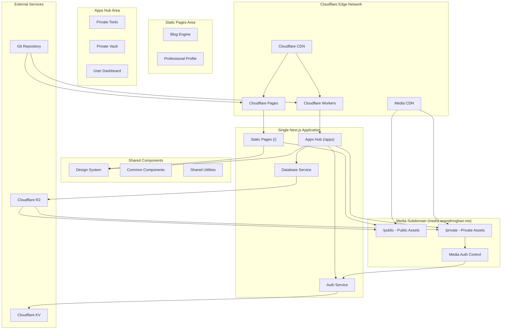

# Design Document: Unified Digital Platform

## Overview

The unified digital platform is a modern web application that combines a public professional site with a private authenticated workspace. The architecture leverages Cloudflare's edge computing capabilities to deliver optimal performance while maintaining clear separation between public and private content.

The platform is built as a single Next.js application with two main areas:
- **Static Pages** (anandmoghan.me): Static site generation for blog and professional content
- **Apps Hub** (anandmoghan.me/apps): Server-side rendered application for dynamic functionality and authentication

Both areas share a unified design system and component library, ensuring consistent branding and user experience across the entire platform.

## Architecture

### High-Level Architecture



### Hosting Strategy

**Single Next.js Application** (anandmoghan.me)
- **Platform**: Cloudflare Pages with Functions for SSR
- **Static Pages**: Static site generation for blog and professional content
- **Apps Hub**: Server-side rendering at `/apps` route for dynamic functionality
- **Authentication**: Integrated auth system with session management
- **Content Delivery**: Global CDN with intelligent caching strategies

**Media Management** (media.anandmoghan.me)
- **Public Media**: Served from `media.anandmoghan.me/public` for static pages
- **Private Media**: Served from `media.anandmoghan.me/private` with authentication control
- **Storage**: Cloudflare R2 with access control policies
- **CDN**: Cloudflare CDN with conditional caching based on authentication

### Technology Stack

**Frontend Framework**: Next.js 15 (latest stable) with App Router
- Static generation for blog and professional pages
- Server-side rendering for apps hub functionality
- Unified routing and middleware system
- Built-in optimization and performance features

**Styling**: Tailwind CSS with custom design tokens
- Dark grey (#374151) and white (#ffffff) base palette
- Light and dark theme support with system preference detection
- Consistent typography and spacing system
- Responsive design patterns with mobile-first approach

**Theme System**:
```typescript
interface ThemeConfig {
  light: {
    background: '#ffffff',
    foreground: '#111827',
    muted: '#f9fafb',
    accent: '#3b82f6'
  },
  dark: {
    background: '#111827',
    foreground: '#f9fafb',
    muted: '#374151',
    accent: '#60a5fa'
  }
}
```

**Content Management**: MDX for blog posts
- Mathematical formula support via KaTeX
- Syntax highlighting for code blocks
- Flexible frontmatter for metadata

**Authentication**: Service-abstracted authentication system
- Pluggable auth providers (Firebase, Supabase, custom)
- Secure session management with JWT tokens
- Role-based access control with middleware protection

**Database**: Service-abstracted data layer
- Pluggable database providers (Firebase Firestore, Supabase, PostgreSQL)
- Type-safe data access with schema validation
- Caching layer for performance optimization

**Media Storage**: Cloudflare R2 with subdomain routing
- Public assets served from `media.anandmoghan.me/public` (no auth required)
- Private assets served from `media.anandmoghan.me/private` (auth required)
- Conditional CDN caching based on authentication status
- Access control policies integrated with authentication service

## Project Structure

The unified platform follows a single Next.js application structure with clear separation between static and dynamic areas:

```
unified-digital-platform/
├── app/                          # Next.js App Router
│   ├── (static-pages)/          # Static pages group
│   │   ├── page.tsx             # Home/profile page
│   │   ├── blog/                # Blog pages
│   │   └── about/               # About page
│   ├── apps/                    # Apps hub area
│   │   ├── layout.tsx           # Apps-specific layout
│   │   ├── page.tsx             # Apps dashboard
│   │   ├── tools/               # Private tools
│   │   └── vault/               # Private vault
│   ├── api/                     # API routes
│   │   ├── auth/                # Authentication endpoints
│   │   ├── blog/                # Blog data endpoints
│   │   └── media/               # Media management
│   ├── globals.css              # Global styles
│   └── layout.tsx               # Root layout
├── common/                      # Shared components and services
│   ├── components/              # Reusable UI components
│   ├── services/                # Service abstractions
│   │   ├── auth/                # Auth service implementations
│   │   ├── database/            # Database service implementations
│   │   └── media/               # Media service implementations
│   ├── hooks/                   # Custom React hooks
│   ├── utils/                   # Utility functions
│   └── types/                   # TypeScript type definitions
├── content/                     # Content files
│   ├── blog/                    # Blog posts (MDX)
│   └── media/                   # Local media assets
├── scripts/                     # Utility scripts
│   ├── upload-media.ts          # Media upload script
│   ├── optimize-images.ts       # Image optimization script
│   └── sync-content.ts          # Content synchronization script
├── public/                      # Static assets
└── styles/                      # Additional stylesheets
```

This structure provides:
- Clear separation between static and dynamic functionality
- Shared component library accessible from both areas
- Service abstraction layer for easy provider switching
- Organized content management
- Scalable architecture for future expansion

### Media Architecture

The platform uses a dedicated media subdomain with authentication-based access control:

**Public Media** (`media.anandmoghan.me/public/`)
- Accessible without authentication
- Used by static pages for blog images, profile photos, etc.
- Cached aggressively by Cloudflare CDN
- Served directly from Cloudflare R2

**Private Media** (`media.anandmoghan.me/private/`)
- Requires valid authentication
- Used by apps hub for private documents, family photos, etc.
- Conditional caching based on authentication status
- Access control enforced by Cloudflare Workers
- Integration with authentication service for permission validation

**Media Service Implementation**:
```typescript
class MediaService {
  getPublicUrl(path: string): string {
    return `https://media.anandmoghan.me/public/${path}`
  }
  
  async getPrivateUrl(path: string, userId: string): Promise<string> {
    const hasAccess = await this.validateAccess(path, userId)
    if (!hasAccess) throw new Error('Access denied')
    return `https://media.anandmoghan.me/private/${path}`
  }
  
  async validateAccess(path: string, userId: string): Promise<boolean> {
    // Implement access control logic
    return this.authService.hasMediaAccess(userId, path)
  }
}
```

**Media Upload Script**:
The platform includes a CLI script for managing media uploads to Cloudflare R2:

```typescript
// scripts/upload-media.ts
interface UploadOptions {
  source: string        // Local file or directory path
  destination: string   // R2 path (public/ or private/)
  type: 'public' | 'private'
  overwrite?: boolean   // Update if media already exists
  optimize?: boolean    // Optimize images during upload
  generateThumbnails?: boolean
}

class MediaUploadScript {
  async uploadMedia(options: UploadOptions): Promise<UploadResult[]> {
    const files = await this.scanFiles(options.source)
    const results: UploadResult[] = []
    
    for (const file of files) {
      const exists = await this.checkExists(file.path, options.destination)
      
      if (exists && !options.overwrite) {
        console.log(`Skipping ${file.name} - already exists`)
        continue
      }
      
      if (options.optimize && this.isImage(file)) {
        file = await this.optimizeImage(file)
      }
      
      const result = await this.uploadToR2(file, options)
      results.push(result)
      
      if (exists) {
        console.log(`Updated ${file.name}`)
      } else {
        console.log(`Uploaded ${file.name}`)
      }
    }
    
    return results
  }
  
  private async checkExists(filePath: string, destination: string): Promise<boolean> {
    // Check if file exists in R2
    return this.r2Client.exists(`${destination}/${filePath}`)
  }
  
  private async optimizeImage(file: File): Promise<File> {
    // Optimize images using Sharp or similar
    return this.imageOptimizer.optimize(file)
  }
  
  private async uploadToR2(file: File, options: UploadOptions): Promise<UploadResult> {
    const key = `${options.destination}/${file.path}`
    
    return this.r2Client.upload({
      key,
      body: file.buffer,
      contentType: file.mimeType,
      metadata: {
        originalName: file.name,
        uploadedAt: new Date().toISOString(),
        type: options.type
      }
    })
  }
}
```

**CLI Usage Examples**:
```bash
# Upload public images (overwrite existing)
npm run upload-media -- --source ./assets/images --type public --overwrite --optimize

# Upload private documents
npm run upload-media -- --source ./private-docs --type private

# Upload single file with thumbnails
npm run upload-media -- --source ./photo.jpg --type private --generate-thumbnails

# Sync entire directory (update existing files)
npm run upload-media -- --source ./media --type public --overwrite --optimize
```

## Components and Interfaces

### Design System Architecture

The design system provides a unified visual identity across both platforms:

```typescript
// Design System Structure
interface DesignSystem {
  colors: {
    light: {
      background: '#ffffff',
      foreground: '#111827',
      muted: '#f9fafb',
      border: '#e5e7eb',
      accent: '#3b82f6',
      destructive: '#ef4444',
      success: '#10b981'
    },
    dark: {
      background: '#111827',
      foreground: '#f9fafb',
      muted: '#374151',
      border: '#4b5563',
      accent: '#60a5fa',
      destructive: '#f87171',
      success: '#34d399'
    }
  },
  typography: {
    fonts: {
      sans: ['Inter', 'system-ui'],
      mono: ['JetBrains Mono', 'monospace']
    },
    scales: {
      xs: '0.75rem',
      sm: '0.875rem',
      base: '1rem',
      lg: '1.125rem',
      xl: '1.25rem',
      '2xl': '1.5rem',
      '3xl': '1.875rem'
    }
  },
  spacing: {
    unit: '0.25rem', // 4px base unit
    scales: [0, 1, 2, 3, 4, 6, 8, 12, 16, 24, 32, 48, 64]
  },
  themes: {
    system: 'auto', // Follow system preference
    light: 'light',
    dark: 'dark'
  }
}
```

### Component Library

**Shared Components** (`/common/components/`)
- `Header`: Navigation with theme toggle and authentication state awareness
- `Footer`: Consistent footer across all pages with theme support
- `Layout`: Base layout wrapper with responsive design and theme provider
- `Button`: Styled button variants with loading states and theme variants
- `Card`: Content container with consistent styling and theme support
- `Modal`: Overlay component for dialogs and forms with theme-aware styling
- `ThemeProvider`: Context provider for theme management and persistence
- `ThemeToggle`: Component for switching between light/dark themes

**Content Components** (`/common/content/`)
- `BlogPost`: Article rendering with formula support and theme-aware syntax highlighting
- `FormulaRenderer`: KaTeX integration with theme-aware mathematical expressions
- `CodeBlock`: Syntax-highlighted code display with theme support
- `TagList`: Flexible tagging system display with theme variants
- `MediaGallery`: Responsive image gallery with lazy loading and theme-aware overlays

**Service Components** (`/common/services/`)
- `AuthService`: Abstract authentication service with provider implementations
- `DatabaseService`: Abstract database service with provider implementations
- `ThemeService`: Theme management and persistence service

### Service Abstractions

**Authentication Service Interface**
```typescript
interface AuthService {
  // Core authentication methods
  signIn(credentials: LoginCredentials): Promise<AuthResult>
  signOut(): Promise<void>
  getCurrentUser(): Promise<User | null>
  
  // Session management
  validateSession(token: string): Promise<User | null>
  refreshSession(): Promise<AuthResult>
  
  // User management
  createUser(userData: CreateUserData): Promise<User>
  updateUser(userId: string, updates: Partial<User>): Promise<User>
  deleteUser(userId: string): Promise<void>
}

// Provider implementations
class FirebaseAuthService implements AuthService { /* ... */ }
class SupabaseAuthService implements AuthService { /* ... */ }
class CustomAuthService implements AuthService { /* ... */ }
```

**Database Service Interface**
```typescript
interface DatabaseService {
  // Document operations
  create<T>(collection: string, data: T): Promise<T & { id: string }>
  read<T>(collection: string, id: string): Promise<T | null>
  update<T>(collection: string, id: string, updates: Partial<T>): Promise<T>
  delete(collection: string, id: string): Promise<void>
  
  // Query operations
  query<T>(collection: string, filters: QueryFilter[]): Promise<T[]>
  paginate<T>(collection: string, options: PaginationOptions): Promise<PaginatedResult<T>>
  
  // Real-time subscriptions
  subscribe<T>(collection: string, callback: (data: T[]) => void): () => void
}

// Provider implementations
class FirestoreService implements DatabaseService { /* ... */ }
class SupabaseService implements DatabaseService { /* ... */ }
class PostgreSQLService implements DatabaseService { /* ... */ }
```

### API Interfaces

**Static Pages APIs** (Static Generation)
```typescript
interface BlogAPI {
  getAllPosts(): Promise<BlogPost[]>
  getPostBySlug(slug: string): Promise<BlogPost>
  getPostsByTag(tag: string): Promise<BlogPost[]>
  getTags(): Promise<Tag[]>
}

interface MediaAPI {
  getPublicAssets(): Promise<MediaAsset[]>
  getAssetByPath(path: string): Promise<MediaAsset>
  optimizeImage(asset: MediaAsset, options: ImageOptions): Promise<string>
  getPublicMediaUrl(path: string): string // Returns media.anandmoghan.me/public/path
}
```

**Apps Hub APIs** (Server-Side)
```typescript
interface AppsAPI {
  getPrivateAssets(userId: string): Promise<MediaAsset[]>
  getPrivateTools(userId: string): Promise<Tool[]>
  createTool(userId: string, tool: ToolData): Promise<Tool>
  updateTool(toolId: string, updates: Partial<ToolData>): Promise<Tool>
}

interface PrivateMediaAPI {
  getPrivateMediaUrl(path: string, userId: string): Promise<string> // Returns authenticated URL
  uploadPrivateAsset(userId: string, file: File): Promise<MediaAsset>
  deletePrivateAsset(userId: string, assetId: string): Promise<void>
  validateMediaAccess(path: string, userId: string): Promise<boolean>
}

interface ThemeAPI {
  getUserTheme(userId: string): Promise<ThemePreference>
  updateUserTheme(userId: string, theme: ThemePreference): Promise<void>
  getSystemTheme(): Promise<'light' | 'dark'>
}
```

## Data Models

### Content Models

```typescript
interface BlogPost {
  id: string
  slug: string
  title: string
  content: string // MDX content
  excerpt: string
  publishedAt: Date
  updatedAt: Date
  tags: Tag[]
  author: Author
  metadata: {
    readingTime: number
    wordCount: number
    hasFormulas: boolean
  }
}

interface Tag {
  id: string
  name: string
  category: 'official' | 'personal' | 'technical' | 'family'
  color: string
  description?: string
}

interface MediaAsset {
  id: string
  filename: string
  path: string
  publicUrl?: string // For public assets: media.anandmoghan.me/public/path
  privateUrl?: string // For private assets: media.anandmoghan.me/private/path (auth required)
  type: 'image' | 'document' | 'video'
  size: number
  dimensions?: { width: number; height: number }
  isPrivate: boolean
  uploadedAt: Date
  metadata: Record<string, any>
}
```

### Authentication Models

```typescript
interface User {
  id: string
  email: string
  name: string
  role: 'admin' | 'user'
  permissions: Permission[]
  createdAt: Date
  lastLoginAt: Date
}

interface Session {
  id: string
  userId: string
  token: string
  refreshToken: string
  expiresAt: Date
  createdAt: Date
  ipAddress: string
  userAgent: string
}

interface Permission {
  resource: string
  actions: ('read' | 'write' | 'delete')[]
}
```

### Application Models

```typescript
interface Tool {
  id: string
  name: string
  description: string
  type: 'utility' | 'calculator' | 'converter' | 'analyzer'
  config: Record<string, any>
  isActive: boolean
  createdAt: Date
  updatedAt: Date
}

interface PrivateDocument {
  id: string
  title: string
  content: string
  type: 'note' | 'document' | 'data'
  tags: string[]
  isEncrypted: boolean
  createdAt: Date
  updatedAt: Date
}

interface ThemePreference {
  id: string
  userId: string
  theme: 'light' | 'dark' | 'system'
  customColors?: {
    accent?: string
    background?: string
    foreground?: string
  }
  updatedAt: Date
}

interface SystemTheme {
  current: 'light' | 'dark'
  supportsColorScheme: boolean
  prefersReducedMotion: boolean
}
```

## Correctness Properties

*A property is a characteristic or behavior that should hold true across all valid executions of a system—essentially, a formal statement about what the system should do. Properties serve as the bridge between human-readable specifications and machine-verifiable correctness guarantees.*

Based on the prework analysis, I'll now create properties that eliminate redundancy and focus on the most valuable correctness guarantees:

**Property 1: Formula rendering consistency**
*For any* blog post containing mathematical notation, the Formula_Renderer should render all equations accurately and maintain readability across different screen sizes without causing layout shifts
**Validates: Requirements 5.1, 5.3, 5.4**

**Property 2: Authentication access control**
*For any* request to private areas, the Authentication_System should require valid credentials for unauthenticated users and grant access for authenticated users
**Validates: Requirements 2.1, 2.2, 10.1**

**Property 3: Media access control by authentication state**
*For any* media request, the system should serve only public assets to unauthenticated users and unlock private assets for authenticated users
**Validates: Requirements 6.1, 6.2**

**Property 4: Design system and theme consistency**
*For any* rendered component across static pages and apps hub, the Design_System should maintain consistent styling, support both light and dark themes, and respond to user theme preferences
**Validates: Requirements 3.1, 3.2, 3.5**

**Property 5: Tagging system operations**
*For any* blog post, the Tagging_System should support adding, removing, and filtering by multiple tag categories while maintaining consistency across all content
**Validates: Requirements 4.1, 4.2, 4.4, 4.5**

**Property 6: Performance thresholds**
*For any* page load on either platform, the system should deliver initial content within 2 seconds and maintain smooth navigation transitions
**Validates: Requirements 9.1, 9.2, 9.5**

**Property 7: Session management security**
*For any* authentication session, the system should maintain secure session management, handle expiration gracefully, and encrypt sensitive data
**Validates: Requirements 10.2, 10.3, 10.4**

**Property 8: Deployment and routing coordination**
*For any* code change pushed to the repository, the Deployment_Pipeline should update both static pages and apps hub areas simultaneously with zero downtime and proper route handling
**Validates: Requirements 7.1, 7.2, 7.3, 7.4**

**Property 9: Service abstraction and component propagation**
*For any* modification to shared components or service implementations, the changes should automatically propagate to all dependent areas while maintaining proper abstraction boundaries between services
**Validates: Requirements 3.3, 8.2, 8.3**

**Property 10: Media optimization performance**
*For any* media asset served by the platform, the system should optimize delivery for high performance and support high-resolution display without compromising load times
**Validates: Requirements 6.3, 6.5, 9.3**

## Error Handling

### Authentication Errors

**Session Expiration**
- Graceful redirect to login page with return URL preservation
- Clear error messaging without exposing sensitive information
- Automatic cleanup of expired session data

**Invalid Credentials**
- Rate limiting to prevent brute force attacks
- Generic error messages to avoid user enumeration
- Secure logging of authentication attempts

**Authorization Failures**
- Clear distinction between authentication and authorization errors
- Appropriate HTTP status codes (401 vs 403)
- Fallback to public content when private access is denied

### Content Rendering Errors

**Formula Rendering Failures**
- Fallback to raw LaTeX when KaTeX fails
- Error boundaries to prevent page crashes
- Progressive enhancement for mathematical content

**Media Loading Errors**
- Placeholder images for failed loads
- Retry mechanisms for transient failures
- Graceful degradation for unsupported formats

**Build-Time Errors**
- Comprehensive error reporting during static generation
- Fallback content for missing or corrupted data
- Build process continuation despite individual content failures

### Network and Performance Errors

**CDN Failures**
- Automatic failover to origin servers
- Cached content serving during outages
- Performance monitoring and alerting

**API Timeouts**
- Configurable timeout thresholds
- Retry logic with exponential backoff
- Circuit breaker patterns for failing services

**Resource Loading Failures**
- Progressive loading with fallbacks
- Critical resource prioritization
- Offline-first strategies where applicable

## Testing Strategy

### Dual Testing Approach

The platform employs both unit testing and property-based testing to ensure comprehensive coverage:

**Unit Tests**: Focus on specific examples, edge cases, and integration points
- Authentication flow testing with specific credentials
- Component rendering with known data sets
- Error condition handling with controlled inputs
- API endpoint testing with mock data

**Property Tests**: Verify universal properties across all inputs
- Formula rendering consistency across different mathematical expressions
- Authentication behavior across various user states and permissions
- Performance characteristics across different content types and sizes
- Design system consistency across all component variations

### Property-Based Testing Configuration

**Framework**: Fast-check for TypeScript/JavaScript property testing
- Minimum 100 iterations per property test to ensure thorough coverage
- Custom generators for domain-specific data types (blog posts, user sessions, media assets)
- Shrinking capabilities to find minimal failing examples

**Test Organization**:
- Each correctness property implemented as a single property-based test
- Tests tagged with feature name and property reference
- Tag format: **Feature: unified-digital-platform, Property {number}: {property_text}**

**Coverage Areas**:
- **Authentication Properties**: Session management, access control, security
- **Content Properties**: Formula rendering, media optimization, tagging consistency
- **Performance Properties**: Load times, rendering performance, optimization
- **Design Properties**: Visual consistency, component behavior, responsive design
- **Deployment Properties**: Pipeline reliability, rollback capabilities, coordination

### Integration Testing

**End-to-End Scenarios**:
- Complete user journeys from public site to authenticated areas
- Content creation and publishing workflows
- Media upload and access control verification
- Cross-platform navigation and consistency

**Performance Testing**:
- Load time measurements under various conditions
- Stress testing for concurrent user scenarios
- Memory usage and resource optimization validation
- CDN and caching effectiveness verification

### Security Testing

**Authentication Security**:
- Session hijacking prevention
- CSRF protection verification
- Password security and hashing validation
- Rate limiting effectiveness

**Data Protection**:
- Encryption at rest and in transit verification
- Access control boundary testing
- Data leakage prevention
- Privacy compliance validation

The testing strategy ensures that both specific use cases and general system properties are thoroughly validated, providing confidence in the platform's reliability and security across all operational scenarios.